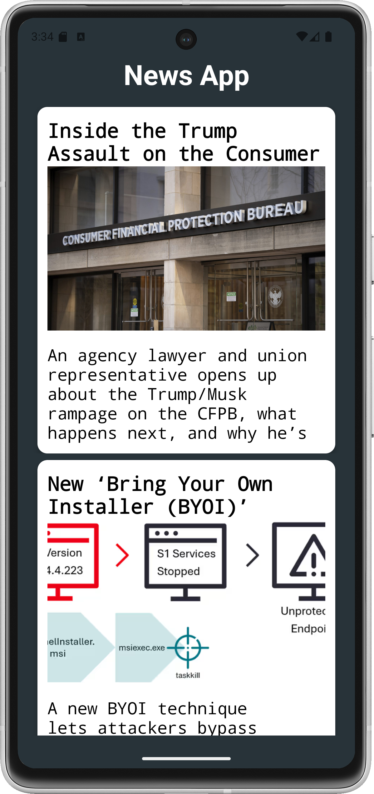
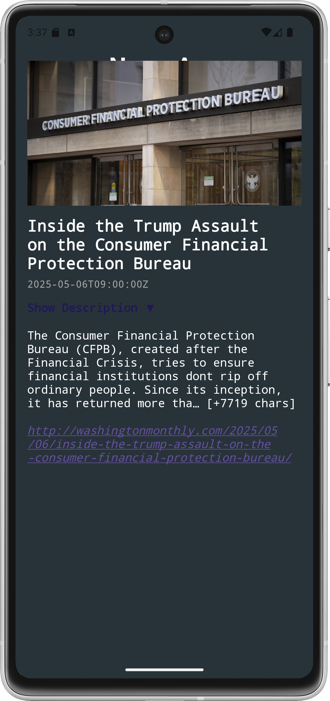

# 📰 NewsApp - Android News Reader

A sleek, modern News App built using **Kotlin**, **MVVM architecture**, and **Retrofit** that fetches and displays the latest news articles from a public API. Users can view headlines, images, and click into a detailed screen with more information.

## 🚀 Features

- 📄 List of latest news articles in a scrollable RecyclerView
- 🖼️ Displays article image, title, and description
- 🔍 Clicking a card opens a full-screen fragment with complete article details
- 🔽 Description toggle (expand/collapse)
- 🌐 Loads article images with Glide
- 🧠 MVVM architecture with LiveData and ViewModel
- 🛠️ Retrofit-based REST API integration

## 🏗️ Tech Stack

- **Language:** Kotlin
- **UI:** XML, ConstraintLayout, RecyclerView, CardView
- **Architecture:** MVVM
- **Networking:** Retrofit
- **Image Loading:** Glide
- **Navigation:** Fragment transactions
- **Async:** Coroutines

## 📦 Project Structure

com.example.newsapp/
├── data/              # Models, Retrofit interfaces, API response classes
├── view/              # RecyclerView Adapter
├── fragments/         # NewsFragment (details screen)
├── viewmodel/         # ViewModel class with LiveData
├── MainActivity.kt    # Hosts the RecyclerView and manages fragment transaction

## 📱 Screenshots

| Home Screen | Article Detail |
|-------------|----------------|
|  |  |

## 🔧 Setup Instructions

1. Clone the repository:

   git clone https://github.com/your-username/newsapp.git
   cd newsapp

2. Open the project in **Android Studio**.

3. Add your News API base URL and key if required (e.g., in `RetrofitInstance.kt`).

4. Add NewsAPI Key in NewsViewModel.kt

5. Run the app on an emulator or device.
   

## 📌 Notes

* Make sure your API key (if required) is stored securely and not hard-coded.
* Articles with incomplete content can be read fully using the `url` field which you can open in a WebView or external browser.

## 🤝 Contributing

Pull requests are welcome. For major changes, please open an issue first to discuss what you would like to change.

---

*Created with 💻 and ☕ by \[Abdul Mateen R I]*

